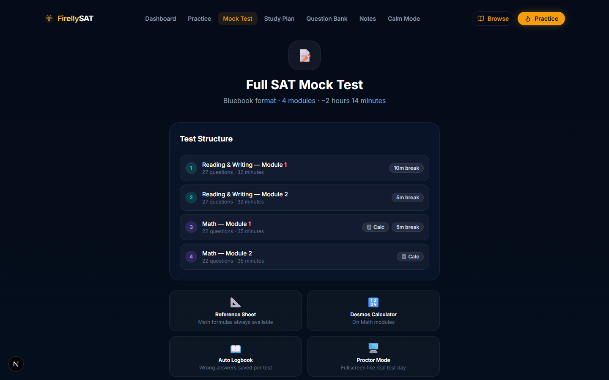
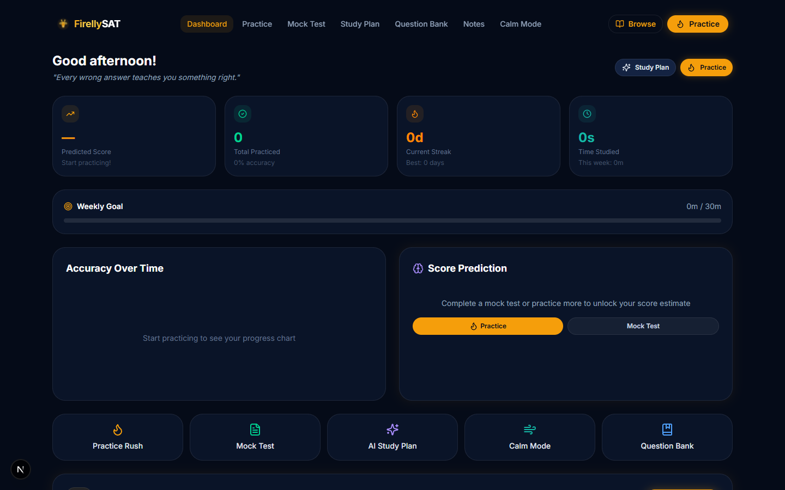
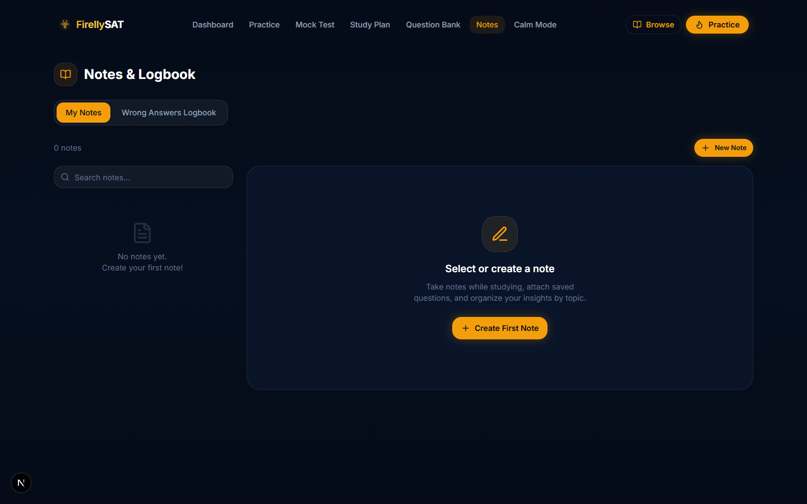
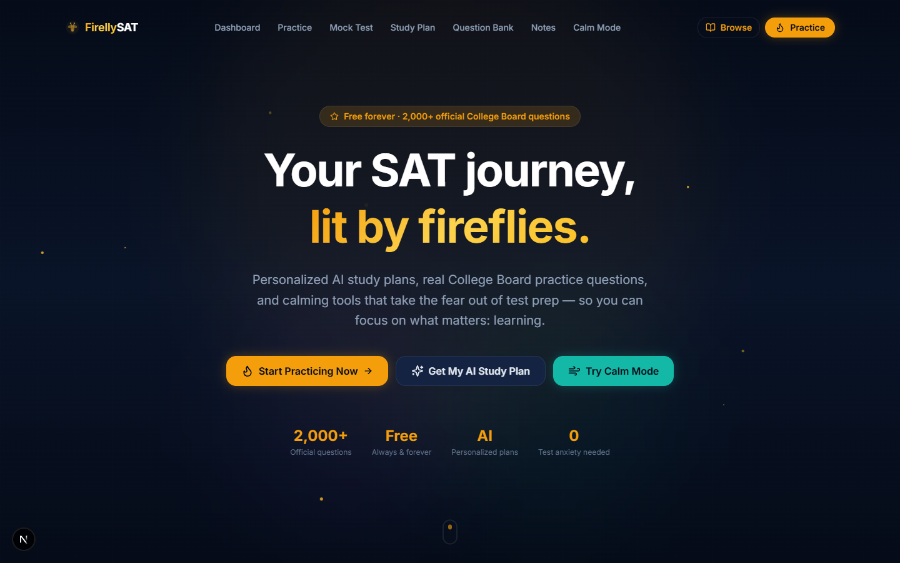
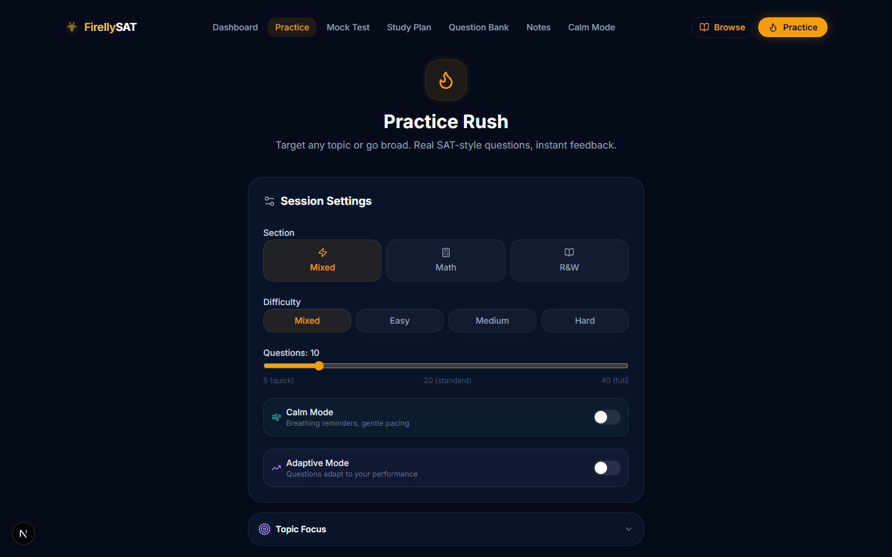

# FirellySAT 🔥

**Free, AI-powered SAT prep that adapts to you — calm your nerves, sharpen your skills, and hit your target score.**

> Built with Next.js 15 · TypeScript · Tailwind CSS v4 · Hugging Face AI · CollegeBoard Official Questions

---

## ✨ Features

### 📚 Practice Rush
Targeted, adaptive practice sessions powered by 2,000+ official CollegeBoard SAT questions.

- **Adaptive Difficulty** — Questions automatically adjust based on your performance, just like the real SAT
- **Topic Focus** — Filter by domain (Math / R&W), skill, and specific subtopics
- **Full-Screen Mode** — Distraction-free practice overlay; covers the navbar entirely
- **Per-Question Timer** — Color-coded (green → amber → red as time increases)
- **Reference Sheet** — Full SAT math formula sheet accessible at any time
- **Desmos Calculator** — Scientific & graphing calculator (Bluebook-style panel)
- **Question Navigator** — Grid view to jump between questions; shows answered/flagged/correct/wrong
- **Smart Logbook** — Wrong answers are automatically saved with explanations
- **Inline Notes** — Add personal notes to any question during review
- **Calm Mode** — Breathing reminders, affirmations, gentle pacing for anxious test-takers


---

### 📝 Full SAT Mock Test
Authentic 4-module Bluebook-format mock test with proctor simulation.

- **4-Module Structure**: R&W Module 1 (27q · 32min) → R&W Module 2 → Math Module 1 (22q · 35min) → Math Module 2
- **Proctor Mode** — Browser enters fullscreen; exits trigger a warning like real test conditions
- **No Repeat Questions** — Tracks used question IDs across attempts; fresh questions each time
- **Timed Breaks** — 10-minute break after R&W, 5-minute breaks between Math modules
- **Module Review Screen** — Review unanswered/flagged questions before submitting each module
- **Accurate Scoring** — Scaled score calculator (200–800 per section) with curve approximation
- **Per-Attempt Logbooks** — Wrong answers tagged to specific mock test attempts
- **Score History** — Track improvement across multiple attempts



---

### 📊 Dashboard
Comprehensive analytics and progress tracking.

- **Mock Test Score** — Latest mock test score displayed prominently (Math + R&W breakdown)
- **Practice-Based Prediction** — AI score estimate when no mock taken yet
- **Score History Chart** — Bar sparkline of all mock test scores over time
- **Accuracy Over Time** — Area chart of practice session accuracy
- **Domain Breakdown** — Performance by Math vs Reading & Writing with difficulty split
- **Skill Heatmap** — Per-skill accuracy across all practice
- **Recent Sessions** — Last 5 practice sessions with scores and times
- **Weekly Goal Tracker** — Progress bar toward weekly study goal
- **Streak Counter** — Current and longest daily practice streak
- **AI Score Prediction** — Weakest skills identified and focus recommendations



---

### 📜 Mock Test History
Dedicated page tracking your mock test journey.

- Full score history list with Math and R&W subscores
- Score trend bar chart across all attempts
- Best score highlighted with "Best" badge
- Direct link to per-test logbook to review mistakes
- Total progress metric (first → latest score)

---

### 📓 Notes & Logbook
Two-tab system for structured review.

**My Notes**
- Create color-coded notes (Amber / Teal / Violet / Rose / Default)
- Tag notes with custom labels
- Attach saved questions directly to notes
- Question snapshots stored offline (works without internet)

**Wrong Answers Logbook**
- All wrong answers auto-saved from Practice Rush and Mock Tests
- Filter by domain, difficulty, and source (Practice vs Mock Test)
- Expandable entries: see your answer vs correct answer + full explanation
- Weak skill stats at a glance
- Clear logbook with confirmation guard



---

### 🧠 AI Study Plan Generator
Personalized week-by-week SAT study plans powered by Hugging Face AI (Qwen 235B).

- Input: current score, target score, test date, daily study time, weak/strong areas, anxiety level
- Output: multi-week plan with daily tasks, focus areas, and encouragement
- Anxiety-aware — includes calming tips and affirmations throughout
- Adjustable study time (15min → 5 hours/day)

---

### 🏦 Question Bank
Browse 2,000+ official CollegeBoard SAT questions.

- Filter by section, difficulty, and skill
- Full-text search across all questions
- Expand questions to see correct answers inline
- Save questions to Notes directly from the bank
- Paginated with 20 questions per page

---

### 🌬️ Calm Mode
Integrated anxiety management features.

- Box breathing exercises
- Motivational affirmations
- Gentle pacing reminders during practice
- Reduced visual noise in exam UI

---

### 💬 AI Study Buddy
Context-aware chat powered by Llama 3.1-8B.

- Ask questions about SAT concepts
- Get strategy advice
- Persistent conversation context

---

## 🖥️ Screenshots

| | |
|---|---|
|  |  |
| **Home — Firefly dark theme** | **Practice Setup — Adaptive mode toggle** |
|  |  |
| **Mock Test — Proctor mode fullscreen** | **Session Analysis — Skill breakdown** |

---

## 🚀 Getting Started

### Prerequisites
- Node.js 18+
- npm / pnpm

### Installation

```bash
git clone https://github.com/Rajbharti06/FirellySAT
cd FirellySAT
npm install
```

### Environment Variables

Create `.env.local`:

```env
HF_API_KEY=your_hugging_face_api_key
NVIDIA_API_KEY=your_nvidia_nim_key  # optional
```

Get your free Hugging Face API key at [huggingface.co/settings/tokens](https://huggingface.co/settings/tokens).

### Run Dev Server

```bash
npm run dev
```

Open [http://localhost:3000](http://localhost:3000).

---

## 🏗️ Tech Stack

| Layer | Technology |
|---|---|
| Framework | Next.js 15 (App Router) |
| Language | TypeScript |
| Styling | Tailwind CSS v4 |
| UI Components | Radix UI primitives + custom |
| Animations | Framer Motion |
| Math Rendering | better-react-mathjax (MathJax 3) |
| Charts | Recharts |
| AI — Study Plan | Hugging Face Inference API (Qwen3-235B-A22B) |
| AI — Chat | Hugging Face (Llama 3.1-8B-Instruct) |
| Calculator | Desmos API (embedded iframe) |
| Questions | CollegeBoard SAT Suite Question Bank API |
| Storage | localStorage (client-side) |
| Hosting | Vercel (recommended) |

---

## 📁 Project Structure

```
src/
├── app/
│   ├── page.tsx              # Landing page
│   ├── practice/             # Practice Rush
│   ├── mock-test/            # Full SAT Mock Test
│   ├── mock-history/         # Mock test attempts history
│   ├── dashboard/            # Analytics & progress
│   ├── notes/                # Notes + Logbook
│   ├── questionbank/         # Browse all questions
│   ├── study-plan/           # AI study plan
│   ├── calm/                 # Breathing exercises
│   └── api/
│       ├── questions/        # CollegeBoard API proxy
│       ├── study-plan/       # AI plan generation
│       └── chat/             # AI buddy
├── components/
│   ├── practice/
│   │   ├── practice-session  # Full-screen practice UI
│   │   ├── reference-sheet   # SAT math formulas panel
│   │   └── desmos-panel      # Desmos calculator panel
│   ├── dashboard/            # Overview component
│   ├── layout/               # Navbar + Footer
│   └── ui/                   # Button, Card, Badge, etc.
├── lib/
│   ├── storage.ts            # localStorage persistence
│   ├── sat-api.ts            # CollegeBoard API client
│   ├── utils.ts              # Helpers + score prediction
│   └── sample-questions.ts   # 30+ fallback questions
└── types/
    └── index.ts              # All TypeScript interfaces
```

---

## 🎨 Design System

**Colors:**
- Background: `#050B18` (deep navy)
- Primary Accent: `#F59E0B` (firefly amber)
- Calm Accent: `#14B8A6` (teal)
- Violet: `#8B5CF6`
- Text: `#F1F5F9` / `#94A3B8` / `#64748B`

**Theme:** Dark-only, firefly-inspired. Glowing amber accents, subtle glass morphism, smooth Framer Motion transitions.

---

## 📈 Adaptive Practice Algorithm

Inspired by the SAT's Item Response Theory (IRT), FirellySAT's adaptive mode:

1. **Starts at Medium difficulty** — balanced starting point
2. **Tracks an adaptive score** — correct answer → +1, wrong answer → -1
3. **Score ≥ 3**: next question is Hard
4. **Score 0–2**: next question is Medium  
5. **Score < 0**: next question is Easy
6. **Never repeats** — tracks seen question IDs within session

This means strong performers face progressively harder questions, while struggling students get targeted practice at a comfortable level before moving up.

---

## 📊 Scoring

Mock test scores use the CollegeBoard's approximate scaling:
- Raw score → 200–800 per section
- Slight curve applied at extremes (< 40% and > 85%)
- Total = Math scaled + R&W scaled (400–1600)

---

## 🤝 Contributing

1. Fork the repository
2. Create a feature branch: `git checkout -b feature/amazing-feature`
3. Commit changes: `git commit -m 'Add amazing feature'`
4. Push: `git push origin feature/amazing-feature`
5. Open a Pull Request

---

## 📄 License

MIT License — see [LICENSE](LICENSE) for details.

---

## 🙏 Acknowledgments

- **CollegeBoard** for the SAT Suite Question Bank
- **Desmos** for the calculator API
- **Hugging Face** for AI inference
- Inspired by [MySATPrep](https://mysatprep.fun/) and the open-source SAT prep community

---

*Built with ❤️ for students everywhere. FirellySAT is not affiliated with CollegeBoard or the SAT.*
